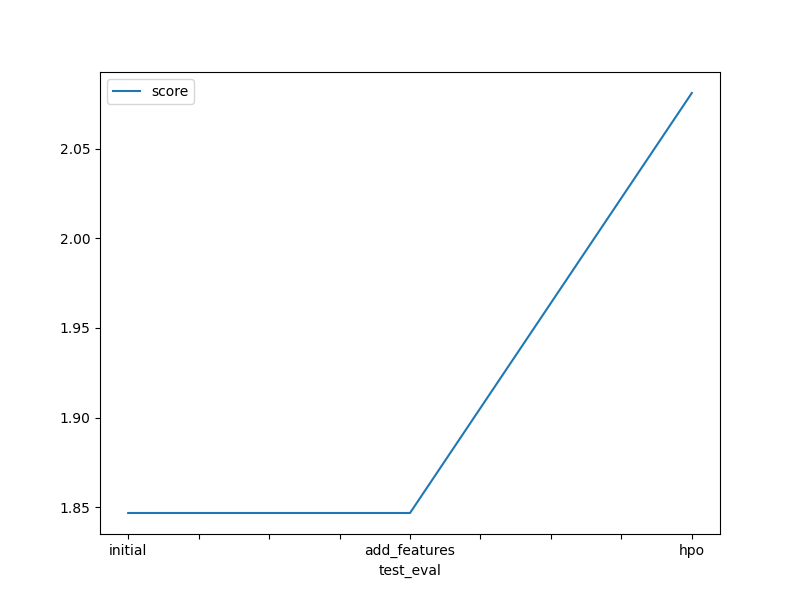

# Report: Predict Bike Sharing Demand with AutoGluon Solution
#### Bui Vinh Hong Duc

## Initial Training
### What did you realize when you tried to submit your predictions? What changes were needed to the output of the predictor to submit your results?
I have realized that data is very important for my submission results. The experimental steps are as follows:

- Initial model setup and first submission: ["submission.csv"]
- Exploratory Data Analysis and adding new features: ["submission_new_features.csv"]
- Hyper parameter optimization: ["submission_new_hpo.csv"]

As far as I know, Kaggle will reject submissions that contain negative predicted values, so we need to replace such results with a value of 0 to submit my results.

### What was the top ranked model that performed?
- In the initial training, the model that gave the best performance was 'WeightedEnsemble_L3' with an accuracy of '-52.694933', followed by 'RandomForestMSE_BAG_L2' with '-53.369370'.

- After adding new features, these two models still gave the best results with '-52.655874' and '-52.956856', respectively.

- When hyperparameter optimization was applied, there was a change. The best-performing models were 'LightGBMLarge_BAG_L1' and 'WeightedEnsemble_L2', both with an accuracy of '0.004274'. However, 'LightGBMLarge_BAG_L1' was the winner due to having better 'eval_metric' and 'pred_time_val' results, with '1.535467' and '17.679069' compared to 'WeightedEnsemble_L2' which had '1.569198' and '17.991972'.

## Exploratory data analysis and feature creation
### What did the exploratory analysis find and how did you add additional features?

- The datetime feature was parsed to extract hour information from the timestamp.
- The independent features season and weather were initially read as integers. Since they are categorical variables, they were converted to the category data type.
- The year, month, day (day of the week), and hour data were extracted as separate independent features from the datetime feature using feature extraction. After this process, the datetime feature was dropped.
- After analyzing the features casual and registered, it was found that the RMSE scores improved significantly during cross-validation, and these features were highly correlated with the target variable count. However, since casual and registered are only present in the training dataset and not in the test data, they were excluded during model training.
- A new categorical feature, day_type, was added based on the holiday and workingday features. This feature was designed to effectively categorize "weekday", "weekend", and "holiday".
- Additionally, the features temp (temperature in degrees Celsius) and atemp ('feels like' temperature in degrees Celsius) had a high positive correlation of 0.98. To reduce multicollinearity between independent variables, atemp was removed from both the training and test datasets.
- Furthermore, data visualization was performed to gain insights from the features.

### How much better did your model preform after adding additional features and why do you think that is?
| File Name                    | Date                 | Description                        | Status    | Public Score | Private Score |
|------------------------------|----------------------|------------------------------------|-----------|--------------|---------------|
| submission_new_features.csv  | 2024-06-27 15:51:18  | new features                       | complete  | 1.84672      | 1.84672       |
| submission.csv               | 2024-06-27 15:16:50  | first raw submission               | complete  | 1.80885      | 1.80885       |
- As you can see, after adding new features, the score only increased from '1.80885' to '1.84672' and the accuracy improved from '-52.694933' to '-52.655874'. This happened because we changed the data type of the 'season' and 'weather' columns from 'integer' to 'category', which is the appropriate data type for these columns. With this data type, the two columns were represented correctly according to the information they convey.
- Additionally, we also split the 'datetime' feature into independent features 'year', 'month', 'day', and 'hour'. This provided more detailed information, helping the model improve its ability to evaluate the temporal aspects of the data.

## Hyper parameter tuning
### How much better did your model preform after trying different hyper parameters?
| File Name                    | Date                 | Description                        | Status    | Public Score | Private Score |
|------------------------------|----------------------|------------------------------------|-----------|--------------|---------------|
| submission_new_hpo.csv       | 2024-06-27 16:02:32  | new features with hyperparameters  | complete  | 2.08165      | 2.08165       |
| submission_new_features.csv  | 2024-06-27 15:51:18  | new features                       | complete  | 1.84672      | 1.84672       |
| submission.csv               | 2024-06-27 15:16:50  | first raw submission               | complete  | 1.80885      | 1.80885       |

As you can see in the table above, after hyperparameter tuning, the model significantly improved its score on the Kaggle test dataset. The score increased to '2.08165' compared to the initial submission of '1.80885'.

### If you were given more time with this dataset, where do you think you would spend more time?
If given more time with this dataset, I would dedicate more effort to Exploratory Data Analysis (EDA). It may lead to discovering composite features that enhance model quality, or simply normalize the features. Additionally, I would like to run AutoGluon with extended training time, coupled with advanced hyperparameter tuning.

### Create a table with the models you ran, the hyperparameters modified, and the kaggle score.
|model|hpo1|score|
|--|--|--|
|initial|no_data|1.80885|
|add_features|no_data|1.84672|
|hpo|hyperparameters{'GBM':[{'extra_trees': True, 'ag_args': {'name_suffix': 'XT'}},'GBMLarge']},hyperparameter_tune_kwargs = {'num_trials': 100,'search_strategy': 'random','scheduler':'local'}|2.08165|

### Create a line plot showing the top model score for the three (or more) training runs during the project.

TODO: Replace the image below with your own.

### Create a line plot showing the top kaggle score for the three (or more) prediction submissions during the project.

TODO: Replace the image below with your own.

## Summary
- On tabular data, AutoGluon accelerated base-line model prototyping.
- The top AutoGluon-based model, enhanced through thorough EDA and feature engineering, outperformed models without hyperparameter optimization.
- AutoGluon's automated hyperparameter tuning, model selection, and ensembling exploited optimal strategies effectively.
- However, while AutoGluon's hyperparameter tuning improved over raw submissions, it fell short of models refined by EDA and feature engineering without hyperparameter tuning.
- Notably, fine-tuning with AutoGluon, excluding default parameters or random configurations, proves intricate, hinging on time limits, predefined presets, model families, and parameter ranges.
