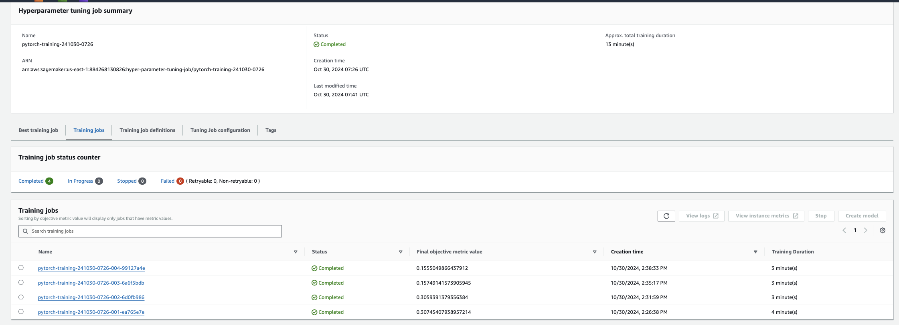
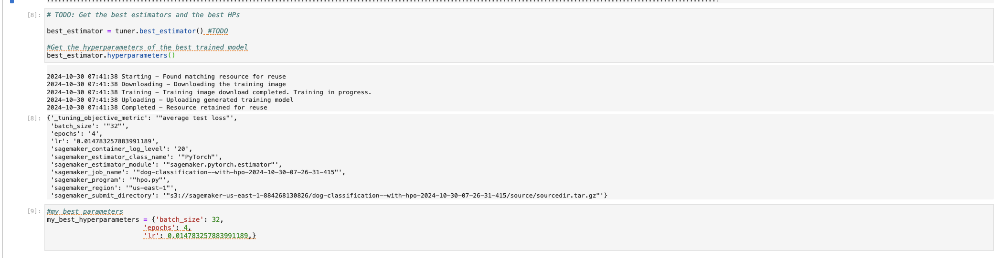
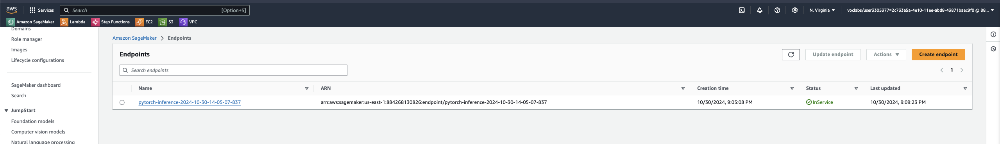

# Image Classification using AWS SageMaker

Use AWS Sagemaker to train a pretrained model that can perform image classification by using the Sagemaker profiling, debugger, hyperparameter tuning and other good ML engineering practices. This can be done on either the provided dog breed classication data set or one of your choice.

## Project Set Up and Installation
Enter AWS through the gateway in the course and open SageMaker Studio. 
Download the starter files.
Download/Make the dataset available.

## Dataset
The provided dataset is the dogbreed classification dataset which can be found in the classroom.
The project is designed to be dataset independent so if there is a dataset that is more interesting or relevant to your work, you are welcome to use it to complete the project.

[Dataset - Click here](https://s3-us-west-1.amazonaws.com/udacity-aind/dog-project/dogImages.zip)

AWS Execulution Role:

The AWS execution role used for the project should have the following access:
 - AmazonSageMakerFullAccess
 - AmazonS3FullAccess

 ```python
 role = get_execution_role()
sagemaker_session = sagemaker.Session()
bucket = sagemaker_session.default_bucket()
print(f'Execition Role: {role}')
print(f'Default s3 bucket : {bucket}')
 ```

### Access
Upload the data to an S3 bucket through the AWS Gateway so that SageMaker has access to the data. 

```python
bucket = "sagemaker-us-east-1-884268130826"

!wget https://s3-us-west-1.amazonaws.com/udacity-aind/dog-project/dogImages.zip
!unzip dogImages.zip > /dev/null
inputs = sagemaker_session.upload_data(path="dogImages", bucket=bucket, key_prefix='imagesDogClassesSet')
```

## Hyperparameter Tuning
What kind of model did you choose for this experiment and why? Give an overview of the types of parameters and their ranges used for the hyperparameter search

For Image classification task and the dataset above, The model was choosed is Pytorch pretrained RestNet50 for transfer learning because it is an CNN and can handle my current task for classification doge image.

In this project, I will tune only 3 prameters:
- batch_size: Typically tested in the range of 16 to 256.
- learning_rate: Commonly tested with values from 0.0001 to 0.1.
- epochs: Range tested from 10 to 200 epochs, depending on data complexity and size.

I have run a hyperparameter tuning job that randomly selects parameters from the search space run a training job, then try to guess the next hyperparameters to pick for subsequent training jobs to improve the `Test Loss` metric.
The best hyperparameters combo will be choosen to fine tune model.

- Screenshot of Completed Training jobs:
    
    

- Logs metrics during the training process:
    | TrainingJobName                           | batch_size |      learning_rate    |  Epoch  |       Test Loss     |  TrainingTime |
    |:------------------------------------------|:-----------|----------------------:|--------:|--------------------:|--------------:|
    | pytorch-training-241030-0726-004-99127a4e | "32"       |  0.014783257883991189 |  4      | 0.1555049866437912  |           179 |
    | pytorch-training-241030-0726-003-6a6f5bdb | "32"       |  0.008832049600146047 |  3      | 0.15749141573905945 |           185 |
    | pytorch-training-241030-0726-002-6d0fb986 | "16"       |  0.031873199661423254 | 4       | 0.3059391379356384  |           189 |
    | pytorch-training-241030-0726-001-ea765e7e | "16"       |  0.0304658177901414   |  5      | 0.30745407938957214 |           227 |

- My best hyperparameters: 
    - batch_size: 32
    - learning_rate: 0.014783257883991189
    - epochs: 4
    

## Debugging and Profiling
I encountered issues when trying to install smdebug so i not use it. I used SageMaker DebuggerHookConfig. SageMaker Debugger is utilized to monitor machine learning training performance, record training and evaluation metrics, and plot learning curves. It can also identify issues such as overfitting, overtraining, poor weight initialization, and vanishing gradients.
Profiling provides insights into compute instance resource utilization, identifies bottlenecks in training algorithms, and delivers detailed rule analysis and summary statistics.

### Results
Here are the insights from the SageMaker analysis on the training loop for image classification:
- Based on the information from the SageMaker Debugger Profiling Report, I can gain an overview of my training process: from the start and end times, training loop duration, time allocated for training and evaluation phases, as well as system usage statistics.
- I used an `ml.t2.large` notebook instance but create training job with instance `ml.m5.2xlarge`. For this task, the training time wasn’t excessively long—around 1 hour for 4 epochs with a batch size of 32.
- Most Triggered Rule: The StepOutlier rule was the most frequently triggered, with 51 instances out of 962 datapoints.
- Average Step Duration: The average step duration on node algo-1-27 during the evaluation phase was 1.13 seconds.
- Outliers: One outlier was detected with a duration more than three times the standard deviation of 0.36 seconds, indicating potential inefficiencies.
- Duration Statistics:
    - Maximum Duration: 4.28 seconds.
    - 99th Percentile (p99): 1.71 seconds, meaning 99% of steps took less than this time.
    - 95th Percentile (p95): 1.25 seconds, indicating the majority of steps are under this duration.
    - Median (p50): 1.10 seconds, suggesting most durations are close to the average.
    - Minimum Duration: 0.12 seconds.
A histogram visualization provides further insight into step duration distribution across nodes, allowing targeted optimization.

Profiler resutls are included and can be found in [ProfilerReport/profiler-output/](./ProfilerReport/profiler-output)


## Model Deployment
**TODO**: Give an overview of the deployed model and instructions on how to query the endpoint with a sample input.
The model was deployed to a SageMaker endpoint for inference with only one instance `ml.m5.2xlarge` (like when it was trained).

For inference image, i implemented script python [inference_my_deploy.py](inference_my_deploy.py) can get image binary with type bytes from image's url as the input for model. The model output is a vector of size 133, corresponding to the number of trained classes. We need to apply argmax on this vector to get the index of the position with the highest probability, which represents the class the model predicts.

How to deploy a model with instance `ml.m5.2xlarge`:
```python
# Get the model location on S3
model_location = estimator.model_data

jpeg_of_serializer = sagemaker.serializers.IdentitySerializer("image/jpeg")
json_of_deserializer = sagemaker.deserializers.JSONDeserializer()

class ImgPredictor(Predictor):
    def __init__( self, endpoint_name, sagemaker_session):
        super(ImgPredictor, self).__init__(
            endpoint_name,
            sagemaker_session = sagemaker_session,
            serializer = jpeg_of_serializer,
            deserializer = json_of_deserializer
        )

#Deploy the model
pytorch_model = PyTorchModel(model_data = model_location,
                             role = role,
                             entry_point= "inference_my_deploy.py",
                             py_version = "py36",
                             framework_version = "1.8",
                             predictor_cls = ImgPredictor
                            )

predictor = pytorch_model.deploy(initial_instance_count = 1, instance_type = "ml.m5.2xlarge")
```

Sample to inference an image with the image's url:
Approach 1:
```python
import requests
from PIL import Image
import io
#request_dict={ "url": "https://cdn1-www.cattime.com/assets/uploads/2011/12/file_2744_british-shorthair-460x290-460x290.jpg" }
image_url = "https://s3.amazonaws.com/cdn-origin-etr.akc.org/wp-content/uploads/2017/11/20113314/Carolina-Dog-standing-outdoors.jpg"
request_dict={"url": image_url}

img_bytes = requests.get(request_dict['url']).content
response = predictor.predict(img_bytes, initial_args={"ContentType": "image/jpeg"})
label_predicted = np.argmax(response, 1)
print(label_predicted)

Image.open(io.BytesIO(img_bytes))
```

Approach 2:
```python
def display_prediction(url):
    request_dict={ "url": url }
    image_bytes = requests.get(request_dict['url']).content
    response=predictor.predict(image_bytes, initial_args={"ContentType": "image/jpeg"})
    display(Image.open(io.BytesIO(image_bytes)))
    label_predictedlabel_predicted = np.argmax(response, 1)
    print(f"Index: {label_predicted}")

display_prediction("https://cdn.mos.cms.futurecdn.net/Tdom4TwTjsVFLhXrNqnZHS-970-80.jpg.webp")
```

- Screenshot of the deployed active endpoint in Sagemaker.



## Standout Suggestions
We can improve by experimenting with training on an instance with stronger GPU capabilities, developing Lambda functions and Step Functions to deploy as an API for seamless integration into other software.
