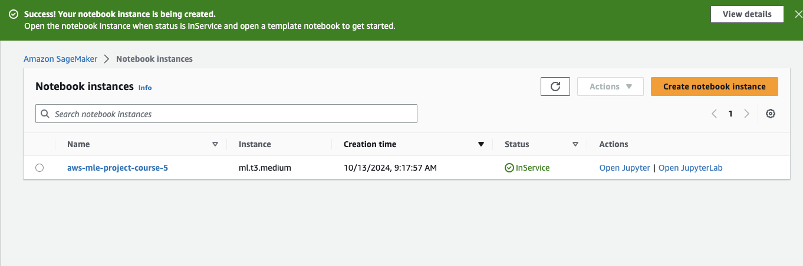
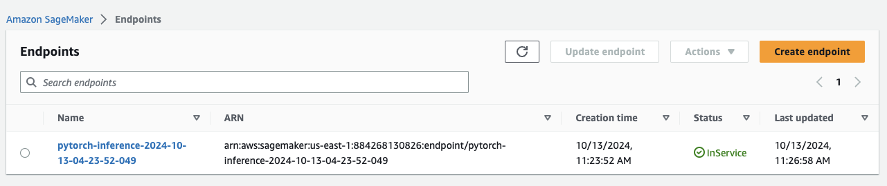
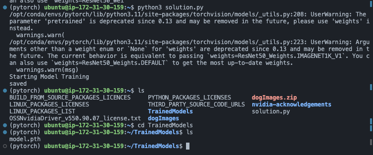
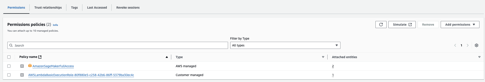
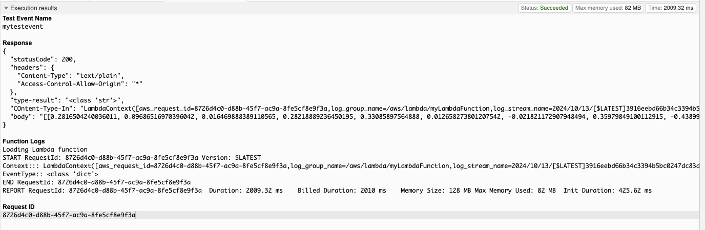
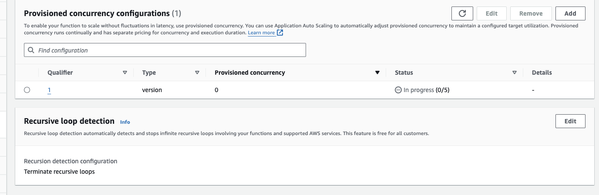
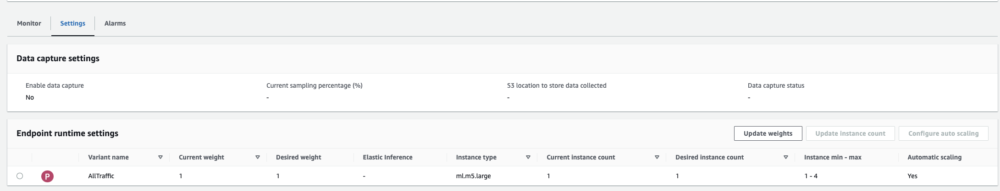

# UDACITY - AWS MACHINE LEARNING NANODEGREE

## Project Course5 - Operationalizing an AWS ML Project

### Step 1: Training and deployment on Sagemaker

**1. Created Notebook instance:**

In this project, I use a notebook with an ml.t3.medium instance because:
- The problem is simple, and time is unlimited, it doesn't require complex calculations, so extensive computational power is not needed. 
- It helps save costs and minimizes financial loss in case I forget to turn off the instance after use.



**2. Deployment:**



### Step 2: EC2 Training

In this section, to train the model on EC2, I prioritize using instances with moderate computational power that support Deep Learning AMI with GPU, prioritizing support for PyTorch 2.0, as we have already trained the model using PyTorch on the notebook, so I want to synchronize both environments. Based on the publicly available pricing on AWS, I use the m5.xlarge instance to save costs.

Image capture finish my training process on EC2 instance:



After training the model on both the notebook and the ec2train1.py file, although both are used for training, there are two key differences between them. Training on the notebook is more convenient for managing, storing, and deploying the model right after training, experimenting with various parameters, and controlling the training job. On the other hand, training with ec2train1.py adapts to the hpo.py file, making it more convenient to configure and modify the model according to personal preferences, though it lacks the streamlined utilities for managing, training, and deploying the model efficiently.

### Step3: Lambda function setup

After completing the Lambda function, it needs to invoke the trained model for inference/data processing through the endpoint deployed on SageMaker. 


### Step 4: Lambda security setup and testing

**1. Adding SageMaker permission to Lambda Functions:**

As previously explained, the Lambda function will call the endpoint that has been deployed on SageMaker for the model. Therefore, we need to add permission to access SageMaker for this Lambda function, otherwise, the code cannot be executed.



In the image we see that have two security policy has been attached to the role:
1. Lambda Function Execution
2. Amazon SageMaker Full Access

Although this resolves the authentication error when the Lambda function invokes the model's endpoint on SageMaker, it poses a security risk.

**2. Testing Lambda Function:**

Here my screen show result when i test my Lambda Function can invoke the model's endpoint on SageMaker via full access permission.



### Step 5: Lambda Concurrency setup and Endpoint Auto-scaling

**1. Concurrency:**

Enabling concurrency for a Lambda function enhances its ability to manage high traffic by allowing it to handle multiple invocations simultaneously. I decided to reserve five instances and allocated two of them.

There are two types of concurrency to consider:

 - Provisioned concurrency: This allocates computing resources that are immediately available to handle requests for a Lambda function. It is a more cost-effective option, but the number of instances has a fixed limit. If the requests exceed this limit, it could lead to delays in processing.

 - Reserved concurrency: This allocates a fixed amount of computing resources specifically for a Lambda function, ensuring the instances are always available to handle any traffic without startup delays, though at a higher cost.


My configuration with Concerrency:



**2. Auto-scaling:**

To manage high traffic, automatic scaling is essential for SageMaker endpoints. Hence, I enabled auto-scaling and configured it in follow image:



As you can see, i configured with:

```
Instance min - max: 1 - 4
> Min instances: 1
> Max instanceS: 4
Target value: 25.
Scale-in time (default): 30 seconds
Scale-out time (default): 30 seconds.
```

